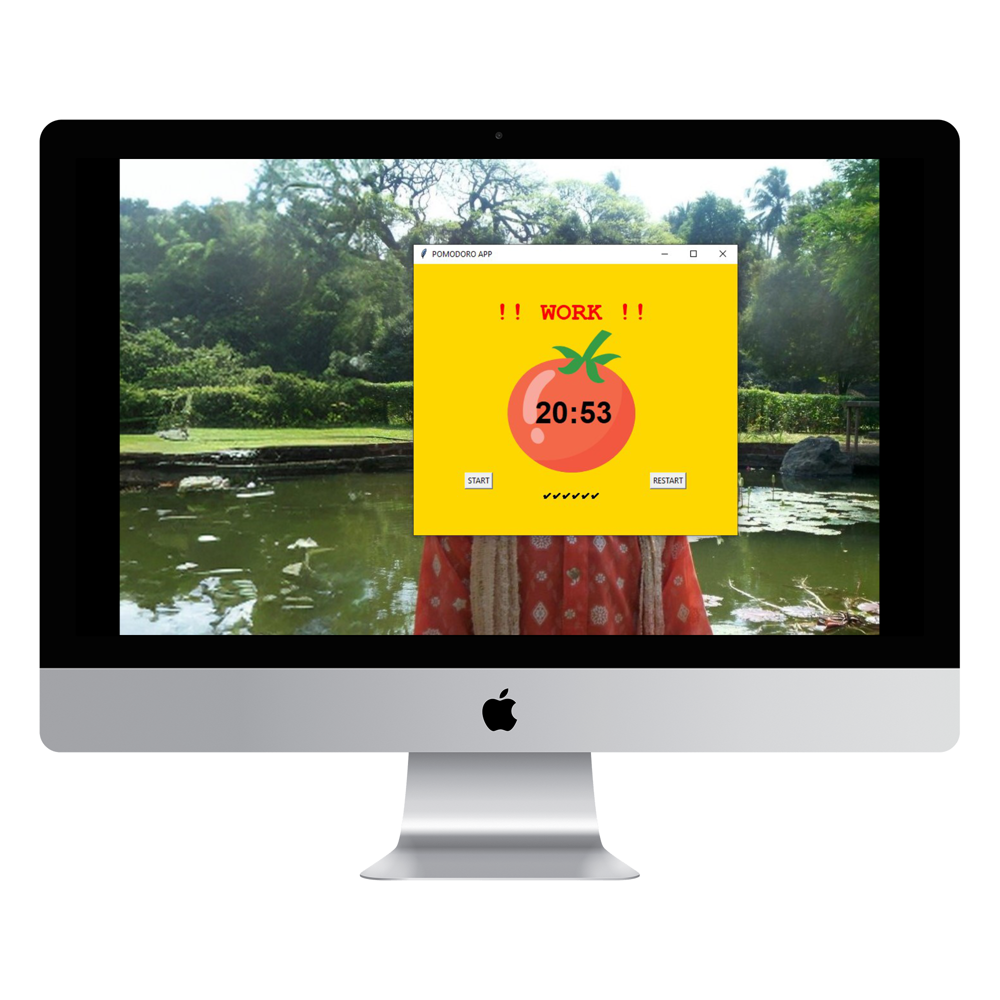

# Pomodoro Timer App

This repository contains a simple Pomodoro Timer app built using Python's Tkinter library. The Pomodoro Timer helps users boost productivity by breaking work into intervals with short and long breaks.

## Features

- **Work Timer**: 25-minute work sessions by default.
- **Short Break**: 5-minute break after each work session.
- **Long Break**: 20-minute break after every four work sessions.
- **Checkmarks**: Visual checkmarks to track completed work sessions.
- **Restart Option**: Allows resetting the timer to start fresh.

## How It Works

The app follows a cycle of **25 minutes** of focused work, followed by a **5-minute short break**. After four work sessions, a **20-minute long break** is triggered.

## Code Explanation

### Constants

- Colors and other UI constants, such as `PINK`, `RED`, `GREEN`, `YELLOW`, `BACKGROUND_COLOR`, and `FONT_COLOR`.
- Default timer values: `WORK_MIN = 25`, `SHORT_BREAK_MIN = 5`, `LONG_BREAK_MIN = 20`.
- `FONT_NAME` for text styling.

### Countdown Mechanism

- **Start Timer**: Initiates a timer for work, short break, or long break, based on the current session.
- **Reset Timer**: Clears the timer, resets variables, and sets the UI back to its default state.

### Timer Countdown

- Continuously updates the countdown every second.
- Switches between sessions (work, short break, long break) and adds checkmarks upon completion of each work session.

### UI Setup

- **Tkinter Window**: Main window with a background color and padding.
- **Canvas**: Displays a tomato image and the timer text.
- **Labels**: Shows the timer status ("Timer", "!! WORK !!", "SHORT BREAK", etc.) and checkmarks for completed work sessions.
- **Buttons**: Includes "START" and "RESTART" buttons for controlling the timer.

## Requirements

- **Python 3**
- **Tkinter Library** (comes pre-installed with Python)
- An image file named `tomato.png` located in the same folder as the `main.py` script.

## Usage

1. Clone the repository.
2. Ensure `tomato.png` is in the same directory as `main.py`.
3. Run `main.py` to start the Pomodoro Timer.
4. Click **START** to begin the timer. The app will automatically switch between work and break sessions.
5. Use **RESTART** to reset the timer and start a new cycle.

## Customization

To change the duration of work and break times, modify these variables in `main.py`:

- `WORK_MIN`
- `SHORT_BREAK_MIN`
- `LONG_BREAK_MIN`

## Screenshots

### Work Session

### Short Break

### Long Break

### Timer

---
